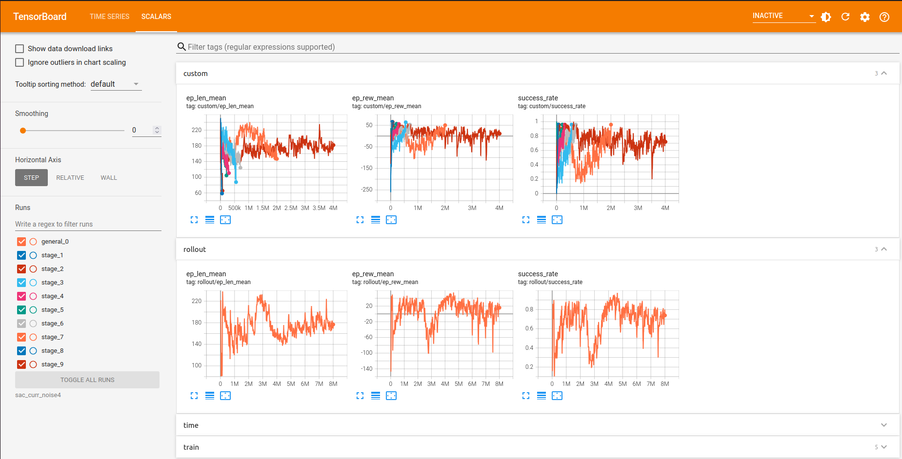

# ur3e_mujoco_tasks

## Overview

This repository contains the implementation of simulated environments and training for robotic manipulation tasks (i.e., peg-in-hole and assembly tasks) with the Universal Robots UR3e manipulator arm in MuJoCo simulation.

DEV NOTES: this repo currently have 2 branches: *(TODO: merge these branches)*
* `peg-in-hole-drl`: implementation of peg-in-hole environment for training with DRL *(Vania's branch)*.
* `suction`: implementation of assembly task environment for training with imitation learning/behavior cloning *(Tanakrit's branch)*.

## Required Library

If manipulator-mujoco library is not installed, added it from the submodule
```bash
git submodule update --init --recursive
cd Manipulator-mujoco
pip install -e .
```

## Additional Installation
```bash
pip install mujoco
pip install spatialmath-python
pip install open3d
```

For `peg-in-hole-drl` branch, install Stable Baselines3 library for DRL training:
```bash
pip install stable-baselines3[extra]
```

> *TODO*: once all the branches are merged, add `stable-baselines3[extra]` to `requirements.txt`

## Running the Simulation of Peg-in-Hole Task

To test the peg-in-hole environment, including the different stages in the curriculum, run the test script:

```bash
cd scripts
python ur3e_peg_in_hole_test.py
```

## Training with DRL

To train the robot to perform peg-in-hole task (with the curriculum embedded in the environment), run `ur3e_peg_in_hole_train_curriculum.py` inside `scripts` folder with this command line:

```bash
python ur3e_peg_in_hole_train_curriculum.py --algorithm=<algorithm_name> --filename=<folder_name>
```

As you can see, you also need to provide the **DRL algorithm** and the **folder name** to save the trained models. Example:
```bash
python ur3e_peg_in_hole_train_curriculum.py --algorithm=SAC --filename=sac_models
```

The trained script will save the trained model **every 50,000 training steps**, as well as **at the end of each curriculum stage** and **at the end of the training** (i.e., once the maximum training steps have been reached). All these models will be saved as separate zip files inside `models/<folder_name>` folder (the script will create the `models` folder automatically if it doesn't exist). In the case of the example above, the models will be saved in `models/sac_models`.

You can also set the number of training steps. This is done by adding the `--total-timesteps` argument.

```bash
python ur3e_peg_in_hole_train_curriculum.py --algorithm=<algorithm_name> --filename=<folder_name> --total-timesteps=<number_of_timesteps>
```

For example, to train a SAC model for 2,000,000 steps, run the command line

```bash
python ur3e_peg_in_hole_train_curriculum.py --algorithm=SAC --filename=sac_models --total-timesteps=2000000
```

Additionally, if you want to see the simulation (i.e., in the MuJoCo GUI) as training progresses, you can add `--render` flag in the command line. Note that you cannot toggle on/off the simulation in the middle of training. Also keep in mind that setting the simulation on will slow down the training quite significantly.

### About Logging

Once training starts, you can track the training in real-time thanks to SB3's Tensorboard integration. The logging files will be saved in `log/<folder_name>` (e.g., `log/sac_models` in the example above). To visualize the logging data, launch Tensorboard in another terminal:

```bash
cd ../log
tensorboard --logdir=<folder_name>
```

An example of the logging data in Tensorboard looks like this:



The plot under *custom* tag shows the logged metrics for each stage (can be toggled on/off from the checkboxes on the left panel, labeled "stage_*"). The plot under *rollout* tag shows the logged metrics for the whole training (i.e., all stages combined).

### Continuing Training from a Trained Model

`ur3e_peg_in_hole_train_curriculum.py` also allows you to continue training a previously trained model. This can be done by running the command line

```bash
python ur3e_peg_in_hole_train_curriculum.py --continue-training --algorithm=<algorithm_name> --filename=<folder_name> --starting-stage=<curriculum_stage>
```

For this to work, the previously trained model must be inside `models/<folder_name>`, and should be labelled with `*_final.zip`. By default, this label is generated by the training script for the saved model at the end of a training.

You also need to set the curriculum stage manually with the `--starting-stage` argument. For example, if we run this command line:
```bash
python ur3e_peg_in_hole_train_curriculum.py --continue-training --algorithm=SAC --filename=sac_models --starting-stage=8
```
this will continue training from the last model in the `sac_models` folder, starting from stage 8 in the curriculum.

### Help

To see all the options you can set within this script, you can run the command line:
```bash
python ur3e_peg_in_hole_train_curriculum.py -h
```

## Testing a Trained Policy

To test a trained policy (or model) in the simulation, run  `ur3e_peg_in_hole_load_policy.py` in the `scripts` folder using the command line

```bash
python ur3e_peg_in_hole_load_policy.py --algorithm=<algorithm_name> --filename=<path_to_model_zip_file>
```

For example, if we want to test the model from `model_stage_9_final.zip`, which is inside `models/sac_models` and trained with SAC algorithm, the command line would be
```bash
python ur3e_peg_in_hole_load_policy.py --algorithm=SAC --filename=sac_models/model_stage_9_final
```

Additionally, you can set in which learning stage you want to test the policy by adding `--learning-stage=<curriculum_stage>` argument to the command line. You can also set the number of episodes to test the policy by adding `--num-episodes=<number_of_episodes>` argument to the command line. Finally, you can set a random seed by adding `--seed=<seed>` argument. 

To see all the options you can set within this script, you can run the command line:
```bash
python ur3e_peg_in_hole_load_policy.py -h
```

As you test the policy, you will be able to see the performance metrics printed at the end of every episode. The performance metrics include:
* Total reward of the last episode
* Maximum contact force (in all axes) within the last episode
* Average episode reward
* Success rate
* Average episode length (i.e., average number of timesteps)
* Average maximum contact force (in all axes)